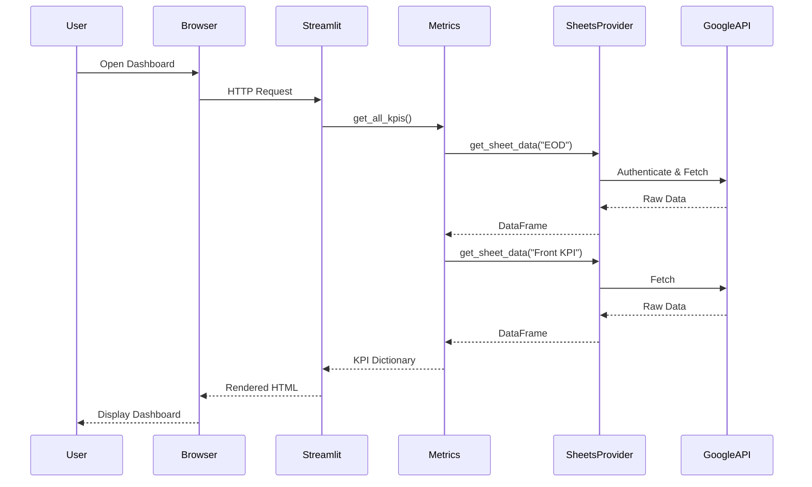

# Data Flow Architecture

## Request Lifecycle



## Data Transformation Pipeline

```
Google Sheets → API Response → JSON → DataFrame → Calculations → Dict → UI Components
```

**Stage 1: Data Retrieval**
- Google Sheets API returns nested arrays
- Convert to pandas DataFrame with headers

**Stage 2: Data Processing**
- Type conversion (strings to numbers)
- Null handling (coerce errors)
- Aggregation (sum, count)

**Stage 3: KPI Calculation**
- Apply business formulas
- Handle edge cases (division by zero)
- Return typed results

**Stage 4: UI Rendering**
- Format numbers (currency, percentage)
- Apply conditional styling
- Display in metric cards
