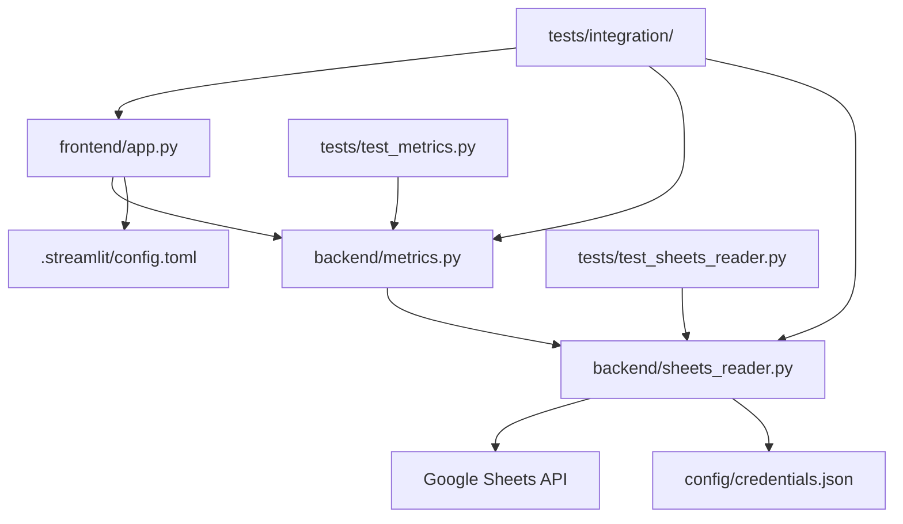

# Source Tree - Dental Analytics Dashboard

## Overview

This document defines the complete project structure for the dental analytics dashboard, providing a clear organizational blueprint for all project files, directories, and their purposes.

## Project Root Structure

```
dental-analytics/
├── .bmad-core/              # BMAD framework configuration and templates
├── .claude/                 # Claude Code configuration
├── .serena/                 # Serena memory system
├── .streamlit/              # Streamlit configuration
├── backend/                 # Backend Python modules
├── config/                  # Configuration files
├── data/                    # Local data storage (if needed)
├── docs/                    # Documentation
├── frontend/                # Frontend application code
├── htmlcov/                 # Test coverage reports
├── tests/                   # Test suite
├── .coveragerc              # Coverage configuration
├── .gitignore               # Git ignore rules
├── .old-files/              # Archived deprecated files
├── CLAUDE.md                # Claude Code project instructions
├── pyproject.toml           # Python project configuration
├── pytest.ini               # Pytest configuration
├── README.md                # Project documentation
├── test_connection.py       # Connection test script
└── uv.lock                  # Dependency lock file
```

## Core Application Structure

### Backend Directory (`backend/`)

```
backend/
├── __init__.py              # Module initialization
├── sheets_reader.py         # Google Sheets API interface (50 lines max)
└── metrics.py               # KPI calculation logic (50 lines max)
```

**Purpose:** Framework-agnostic Python modules for data processing
- No Streamlit dependencies
- Pure business logic
- Returns standard Python types (Dict, DataFrame)

### Frontend Directory (`frontend/`)

```
frontend/
├── app.py                   # Main Streamlit application (100 lines max)
└── .streamlit/
    └── config.toml          # Streamlit theme configuration
```

**Purpose:** Presentation layer using Streamlit
- UI components and layout
- Calls backend modules for data
- Handles display logic only

### Configuration Directory (`config/`)

```
config/
├── credentials.json         # Google service account key (NEVER commit)
└── settings.yaml            # Application settings (future)
```

**Purpose:** Sensitive configuration and credentials
- Must be in .gitignore
- Service account authentication
- Environment-specific settings

### Test Directory (`tests/`)

```
tests/
├── __init__.py              # Test module initialization
├── conftest.py              # Shared pytest fixtures
├── test_metrics.py          # KPI calculation tests
├── test_sheets_reader.py    # Data retrieval tests
├── fixtures/                # Test data fixtures
│   ├── __init__.py
│   ├── sample_eod_data.py
│   ├── sample_front_kpi_data.py
│   └── edge_cases.py
└── integration/             # Integration tests
    ├── __init__.py
    └── test_full_flow.py
```

**Purpose:** Comprehensive test coverage
- Unit tests for each module
- Integration tests for workflows
- Test fixtures for consistent data
- 90% minimum coverage requirement

## Documentation Structure

### Documentation Root (`docs/`)

```
docs/
├── architecture/            # Architecture documentation
│   ├── backend/            # Sharded backend architecture
│   ├── fullstack/          # Sharded full-stack architecture
│   ├── backend-architecture.md
│   ├── fullstack-architecture.md
│   └── source-tree.md      # This document
├── checklists/             # Process checklists
│   └── technical-implementation-checklist.md
├── guides/                 # How-to guides
│   └── google-cloud-setup.md
├── prd/                    # Sharded PRD sections
│   ├── epic-1-complete-dental-analytics-dashboard.md
│   ├── goals-and-background-context.md
│   ├── requirements.md
│   └── index.md
├── prds/                   # Original PRD documents
│   └── dental-analytics-prd.md
├── rules/                  # Business rules and guidelines
│   └── brand-guidelines.md
├── specs/                  # Technical specifications
│   └── dental-dashboard-ui-spec.md
├── stories/                # User stories for development
│   ├── story-1.1.md
│   └── story-1.6-testing-framework.md
└── index.md               # Documentation index
```

**Purpose:** Comprehensive project documentation
- Sharded documents for easy navigation
- Clear separation of concerns
- Version-controlled specifications

## Configuration Files

### Python Configuration

```
pyproject.toml               # Project metadata and dependencies
pytest.ini                   # Test runner configuration
.coveragerc                  # Coverage reporting configuration
```

### Version Control

```
.gitignore                   # Git ignore patterns
```

**Critical .gitignore entries:**
```
config/credentials.json      # Never commit credentials
*.pyc                        # Python bytecode
__pycache__/                # Python cache
.env                        # Environment variables
htmlcov/                    # Coverage reports
.DS_Store                   # macOS metadata
```

### Framework Configuration

```
.streamlit/
└── config.toml             # Streamlit theming and settings

.bmad-core/
├── core-config.yaml        # BMAD framework configuration
├── checklists/            # BMAD checklists
├── tasks/                 # BMAD tasks
└── templates/             # BMAD templates
```

## File Naming Conventions

### Python Files
- Use snake_case: `sheets_reader.py`, `test_metrics.py`, `app.py`
- Test files prefix with `test_`: `test_*.py`
- Configuration: `conftest.py`, `pytest.ini`
- Max 50 lines for backend modules (constraint)

### Documentation Files
- **Regular docs:** kebab-case: `google-cloud-setup.md`, `technical-implementation-checklist.md`
- **Stories:** `story-{epic}.{story}.md`
- **Special files:** ALL_CAPS: `README.md`, `CLAUDE.md`, `CHANGELOG.md`
- **All non-special markdown files must include YAML frontmatter**

### Configuration Files
- Python configs: `pyproject.toml`, `pytest.ini`, `.coveragerc`
- Streamlit: `config.toml`
- Git: `.gitignore`
- YAML files: kebab-case or standard names

### Directories
- Use kebab-case: `docs/`, `tests/`, `config/`
- Backend/frontend: lowercase single word
- No underscores in directory names
- Clear, descriptive naming

## Module Dependencies



## Code Line Constraints

Per project requirements, strict line limits:

| File | Max Lines | Current | Purpose |
|------|-----------|---------|---------|
| backend/sheets_reader.py | 50 | ~45 | Data retrieval |
| backend/metrics.py | 50 | ~48 | KPI calculations |
| frontend/app.py | 100 | ~95 | UI display |
| **Total Production Code** | **200** | **~188** | Complete system |

## Import Structure

### Backend Modules
```python
# sheets_reader.py
from google.oauth2 import service_account
from googleapiclient.discovery import build
import pandas as pd
from typing import Optional, Dict, Any
```

### Frontend Module
```python
# app.py
import streamlit as st
import pandas as pd
from datetime import datetime
from backend.metrics import get_all_kpis
```

### Test Modules
```python
# test files
import pytest
import pandas as pd
from unittest.mock import Mock, patch
from backend.metrics import MetricsCalculator
from backend.sheets_reader import SheetsReader
```

## Environment Setup

### Development Environment
```bash
# Required Python version
python >= 3.10

# Package manager
uv (NOT pip, poetry, or conda)

# Virtual environment (managed by uv)
.venv/
```

### Required External Services
- Google Cloud Project (for Sheets API)
- Google Sheets access (specific spreadsheet)
- Streamlit Cloud account (for deployment)

## Data Flow Through Structure

1. **Entry Point:** `frontend/app.py`
2. **Business Logic:** `backend/metrics.py`
3. **Data Access:** `backend/sheets_reader.py`
4. **External Data:** Google Sheets API
5. **Configuration:** `config/credentials.json`
6. **Display:** Streamlit components

## Security Considerations

### Sensitive Files (Never Commit)
- `config/credentials.json` - Service account key
- `.env` - Environment variables
- Any file with API keys or passwords

### Read-Only Access
- Service account has viewer permission only
- No write operations to Google Sheets
- No data persistence locally

## Development Workflow Files

### BMAD Framework
```
.bmad-core/
├── agents/                 # Agent personas
├── checklists/            # Validation checklists
├── tasks/                 # Executable tasks
└── templates/             # Document templates
```

### Claude Code Integration
```
.claude/
├── data/                  # Claude-specific data
└── hooks/                 # Pre/post action hooks
```

### Serena Memory System
```
.serena/
└── memories/              # Project knowledge persistence
```

## Future Expansion Areas

### Potential Additions (Post-MVP)
```
dental-analytics/
├── api/                   # REST API endpoints (future)
├── database/              # Local data storage (future)
├── exports/               # Report generation (future)
├── logs/                  # Application logging (future)
└── static/                # Static assets (future)
```

## File Creation Order

For new developers, create files in this sequence:

1. **Project Setup**
   - pyproject.toml
   - .gitignore
   - README.md

2. **Backend Implementation**
   - backend/__init__.py
   - backend/sheets_reader.py
   - backend/metrics.py

3. **Frontend Implementation**
   - .streamlit/config.toml
   - frontend/app.py

4. **Testing**
   - pytest.ini
   - tests/conftest.py
   - tests/test_*.py

5. **Documentation**
   - Update relevant docs

## Conclusion

This source tree provides a clear, organized structure for the dental analytics dashboard project. The organization prioritizes:
- Clean separation of concerns
- Testability and maintainability
- Security best practices
- Documentation accessibility
- Compliance with line count constraints

Every file has a clear purpose and designated location, enabling efficient development and maintenance of the system.
